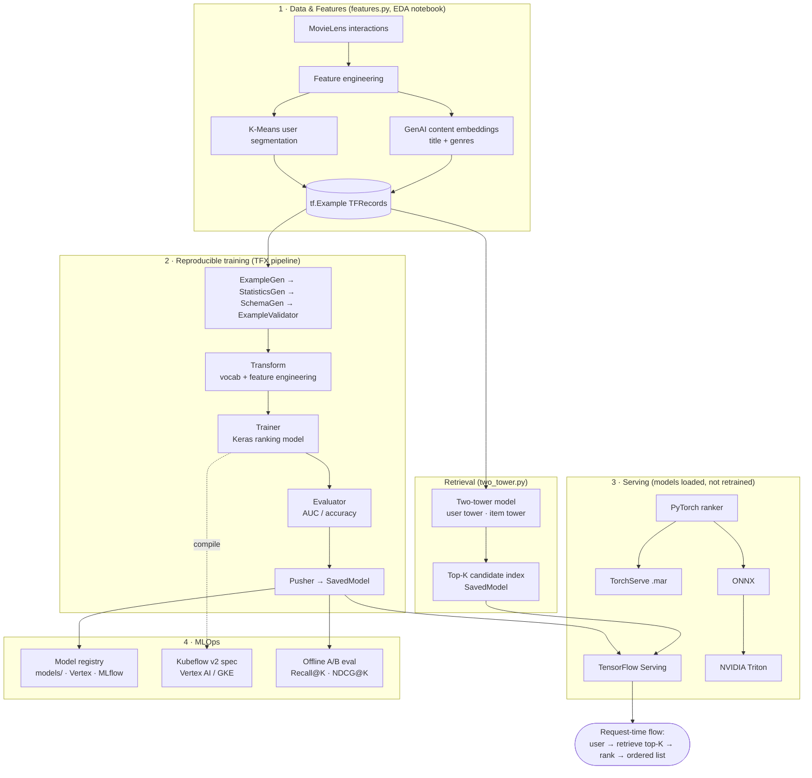

# StreamSense — OTT Content Personalization

A two-stage recommendation system that, given a user and a large content catalogue, returns a
short, well-ordered list of titles the user is most likely to engage with — trained through a
reproducible **TFX pipeline** and served on production-grade infrastructure (**TensorFlow Serving**,
**TorchServe**, **NVIDIA Triton**), orchestrated for **Kubeflow / Vertex AI**.

The reference dataset is [MovieLens](https://grouplens.org/datasets/movielens/)
(`ml-latest-small`), used as a stand-in for OTT viewing-engagement logs. Every stage runs
end-to-end on real data — from exploratory analysis to a deployed, queryable model.

---

## Table of contents

1. [Problem statement](#1-problem-statement)
2. [Solution overview](#2-solution-overview)
3. [System architecture](#3-system-architecture)
4. [Why this design — reasoning, stage by stage](#4-why-this-design--reasoning-stage-by-stage)
5. [Repository structure](#5-repository-structure)
6. [Component walkthrough](#6-component-walkthrough)
7. [End-to-end execution guide](#7-end-to-end-execution-guide)
8. [Technology stack](#8-technology-stack)
9. [Production considerations](#9-production-considerations)
10. [Data and license](#10-data-and-license)

---

## 1. Problem statement

Streaming (OTT) platforms hold catalogues of tens of thousands of titles, while any single user
will ever watch a few hundred. The product problem is **relevance under scale**: surface, for each
user, the small set of titles most worth their attention, and order that set so the best option is
at the top.

Two properties of the data make this hard, and both are quantified in the EDA notebook:

- **Scale.** The catalogue is large (~9.7k items here; millions in production). The system cannot
  afford to run a heavy scoring model over the entire catalogue for every request.
- **Sparsity.** The user–item interaction matrix is ~98% empty. Most users have touched a tiny
  fraction of the catalogue, and most items are rarely watched (a heavy long tail). A model must
  therefore *generalise* across pairs it has never observed rather than memorise co-occurrence.

**Objective.** Maximise engagement quality of the returned list — measured offline with ranking
metrics (Recall@K, NDCG@K) against a held-out signal — subject to a serving-latency budget that
rules out scoring the full catalogue per request.

---

## 2. Solution overview

StreamSense implements the industry-standard **two-stage recommender** pattern (candidate
generation followed by ranking), wrapped in an MLOps lifecycle:

1. **Data & features** — engineer interaction records, derive a user **segment** via clustering,
   and attach **content embeddings** of each title.
2. **Retrieval (candidate generation)** — a **two-tower** model maps users and items into a shared
   embedding space and returns the top-K candidates for a user cheaply (embedding similarity), from
   the whole catalogue.
3. **Ranking** — a neural ranking model scores each retrieved candidate with the probability of
   engagement and orders the shortlist. This model is trained by a **TFX pipeline** (data
   validation → transform → train → evaluate → push).
4. **Serving** — the trained models are loaded (not retrained) by production serving runtimes.
   TensorFlow Serving hosts the TFX-trained ranker; TorchServe and Triton demonstrate the PyTorch
   and ONNX serving paths for the same stage.
5. **Evaluation** — an offline harness compares the ranker against a popularity baseline on real
   labels (Recall@K, NDCG@K).
6. **Orchestration** — the identical TFX pipeline compiles to a **Kubeflow v2** specification that
   runs on Vertex AI / GKE, enabling scheduled retraining.

---

## 3. System architecture



**Request-time flow.** For a user request, the retrieval stage returns a few hundred candidate
titles from the full catalogue; the ranking stage scores and orders only those candidates; the
top-ranked titles are returned. Retrieval keeps the problem tractable at catalogue scale; ranking
provides precision on the shortlist.

---

## 4. Why this design — reasoning, stage by stage

Every component below exists to answer a specific problem the data or the deployment target
imposes. The intent is a single coherent pipeline, not a collection of parallel experiments.

### 4.1 Why two stages instead of one model

A single ranking model cannot score ~9.7k items (millions in production) for every request within a
latency budget, and training it against the full catalogue as candidates is wasteful because the
data is dominated by a popularity long tail (the EDA shows the top 20% of titles account for the
large majority of interactions). The standard resolution — used by large-scale recommenders — is
**candidate generation + ranking**:

- **Retrieval** is cheap and high-recall: it embeds the user once and finds nearby items by vector
  similarity (approximate nearest neighbour in production), shortlisting a few hundred candidates
  from the entire catalogue.
- **Ranking** is expensive and high-precision: it runs a richer model, but only over the small
  shortlist.

This is the single most important structural decision, and it is driven directly by the scale and
long-tail findings in the EDA.

### 4.2 Why a two-tower model for retrieval

Retrieval needs to compare one user against the whole catalogue quickly. A **two-tower**
architecture learns a user encoder and an item encoder that produce vectors in a shared space, so
scoring reduces to a dot product and, at serving time, an approximate-nearest-neighbour lookup. It
also generalises across sparsity (dense embeddings) where co-occurrence counts cannot. Implemented
with **TensorFlow Recommenders (TFRS)** and exported as a SavedModel with a top-K index.

### 4.3 Why embeddings everywhere

The user–item matrix is ~98% empty even among the most active users and most popular items (see the
EDA sparsity heatmap). Learned **embeddings** are what let both the retrieval and ranking models
score user–item pairs never seen together in training. One-hot / count features cannot.

### 4.4 Why user segmentation

User activity spans two orders of magnitude. A single global model under-serves both casual and
power users. A lightweight **K-Means segmentation** on users' content-affinity profiles produces an
8-way `segment` feature that gives the models a cohort signal — cheap, interpretable
personalisation that also helps lower-activity users, and a natural axis for slicing offline
metrics.

### 4.5 Why GenAI content embeddings

Collaborative signal alone is blind to brand-new or rarely-watched titles. Encoding each title's
*"title + genres"* text with a **sentence-transformer** yields a dense content vector, adding a
content-based signal on top of the collaborative one. This is the standard remedy for cold items and
the hook for a future "explain this recommendation" capability. (A deterministic fallback keeps the
pipeline reproducible when the encoder is unavailable.)

### 4.6 Why a TFX training pipeline (and what "TFX" is)

Data and catalogues drift over time (the EDA temporal plot shows multi-year change), so the ranker
must be **retrained reproducibly**, not hand-built once. **TFX is a training/production pipeline
framework, not a serving framework.** It codifies the training lifecycle as a validated DAG:
`ExampleGen → StatisticsGen → SchemaGen → ExampleValidator → Transform → Trainer → Evaluator →
Pusher`. This gives schema validation, a transform graph shared between training and serving (no
train/serve skew), model-evaluation gating, and a versioned "pushed" model — the properties that
distinguish a production pipeline from a notebook.

### 4.7 Why the model is served three ways

Serving runtimes are framework-specific, so demonstrating the major production options requires
matching model formats:

- **TensorFlow Serving** hosts the TFX-trained SavedModel directly — this is the primary serving
  path, and the model already carries its preprocessing in the serving signature (it accepts raw
  `tf.Example` and applies the tf.Transform graph internally, eliminating client-side skew).
- **TorchServe** serves a **PyTorch** implementation of the same ranking model (TorchServe is
  PyTorch-only).
- **NVIDIA Triton** serves the ranker exported to **ONNX**, with dynamic batching configured.

In a real deployment you would **standardise on one** runtime (here, TF Serving for the TFX model).
All three are included to exercise the production serving landscape end-to-end; the PyTorch/ONNX
ranker exists specifically to drive the TorchServe and Triton paths.

### 4.8 Why an offline A/B evaluation

Before any online test, a model must beat a sensible baseline offline. `ab_eval.py` ranks each
user's items with (A) a **popularity baseline** and (B) the **trained ranker**, and reports
**Recall@K** and **NDCG@K** against real labels — the honest, reproducible first gate on model
quality.

---

## 5. Repository structure

```
streamsense-ott-recsys/
├── README.md
├── requirements.txt                    # library set for local development
├── requirements-tfx-lock.txt           # fully-pinned lock for a deterministic TFX install
├── notebooks/
│   ├── StreamSense_EDA.ipynb           # (1) exploratory data analysis + data understanding
│   ├── StreamSense_Colab_TFX.ipynb     # (2) TFX training pipeline, end-to-end + Kubeflow compile
│   └── StreamSense_Colab_Serving.ipynb # (3) serving: TF Serving / TorchServe / Triton
├── src/
│   ├── features.py                     # data load, feature engineering, segmentation, content embeddings
│   ├── two_tower.py                    # TFRS two-tower retrieval model
│   ├── trainer_module.py               # TFX Transform + Trainer module (preprocessing_fn, run_fn)
│   ├── tfx_pipeline.py                 # TFX pipeline (local run) + Kubeflow v2 compile
│   ├── ranking_torch.py                # PyTorch ranking model + TorchScript export
│   ├── export_onnx.py                  # PyTorch → ONNX for Triton
│   └── ab_eval.py                      # offline evaluation: Recall@K, NDCG@K vs popularity baseline
├── serving/
│   ├── tf_serving_run.sh               # launch TensorFlow Serving + sample request
│   ├── torchserve_handler.py           # custom TorchServe inference handler
│   └── torchserve_run.sh               # archive .mar + launch + sample request
├── triton/
│   ├── run_triton.sh                   # launch Triton + client
│   └── model_repository/ranker_onnx/
│       ├── config.pbtxt                # Triton model config (dynamic batching)
│       └── 1/                          # ONNX model version directory
└── models/                             # registered, ready-to-serve models (training→serving handoff)
```

---

## 6. Component walkthrough

| # | Component | Files | Purpose |
|---|-----------|-------|---------|
| 1 | **EDA** | `notebooks/StreamSense_EDA.ipynb` | Characterise the data; each finding maps to a design decision |
| 2 | **Feature engineering** | `src/features.py` | Build interaction records, K-Means `segment`, content embeddings; write TFRecords |
| 3 | **Retrieval** | `src/two_tower.py` | Two-tower candidate generation; export top-K index SavedModel |
| 4 | **Ranking + TFX pipeline** | `src/trainer_module.py`, `src/tfx_pipeline.py`, `notebooks/StreamSense_Colab_TFX.ipynb` | Validate → transform → train → evaluate → push the ranker |
| 5 | **Serving** | `notebooks/StreamSense_Colab_Serving.ipynb`, `serving/`, `triton/` | Load and serve models via TF Serving / TorchServe / Triton |
| 6 | **PyTorch ranker + exports** | `src/ranking_torch.py`, `src/export_onnx.py` | PyTorch model for the TorchServe / ONNX-Triton serving paths |
| 7 | **Offline evaluation** | `src/ab_eval.py` | Recall@K / NDCG@K, ranker vs popularity baseline |
| 8 | **Orchestration** | `src/tfx_pipeline.py --compile-kfp` | Emit Kubeflow v2 spec for Vertex AI / GKE |

The **training → serving handoff** is explicit: the TFX `Pusher` writes a versioned SavedModel
(with its preprocessing baked into the serving signature); serving runtimes **load** that artifact
rather than retraining. `models/` is the POC stand-in for a model registry (MLflow / Vertex Model
Registry / object storage) — one training run, one evaluated model, many serving consumers.

---

## 7. End-to-end execution guide

### Prerequisites

- Python 3.10 or 3.11 (TFX 1.15 does not support 3.12+).
- For serving, a Colab runtime (used for TF Serving / TorchServe / Triton) or Docker locally.

### Step 1 — Explore the data

Open `notebooks/StreamSense_EDA.ipynb` in Google Colab (or Jupyter) and **Run all**. It downloads
MovieLens and produces the rating, activity, popularity, sparsity, temporal, genre, and
segmentation analyses. Read the *Design implication* notes — they justify every downstream choice.

### Step 2 — Build features

```bash
python src/features.py
```

Produces `data/processed/interactions.parquet`, a movies table with content embeddings, and
`data/processed/interactions.tfrecord` (the pipeline's input). Includes K-Means segmentation and
content embeddings.

### Step 3 — Train the retrieval model

```bash
python src/two_tower.py          # exports the top-K retrieval index SavedModel to artifacts/retrieval
```

### Step 4 — Run the TFX ranking pipeline (reproducible training)

Open `notebooks/StreamSense_Colab_TFX.ipynb` in Colab and **Run all**. It installs TFX from the
pinned lock on a managed Python 3.10, then runs the full DAG
(ExampleGen → … → Evaluator → **Pusher**) and compiles the Kubeflow v2 spec. The pushed SavedModel
lands in `artifacts/ranking_tf/` with its vocabularies and serving signature.

*(Locally on x86 Linux you can instead run `python src/tfx_pipeline.py` and
`python src/tfx_pipeline.py --compile-kfp`.)*

### Step 5 — Serve the models

Open `notebooks/StreamSense_Colab_Serving.ipynb` and **Run all**. It loads the pushed/registered
models and serves them via **TensorFlow Serving** (the TFX ranker + retrieval index), **TorchServe**
(the PyTorch ranker), and **NVIDIA Triton** (the ONNX ranker), issuing a sample inference against
each.

### Step 6 — Evaluate offline

```bash
python src/ab_eval.py            # Recall@K / NDCG@K: trained ranker vs popularity baseline
```

### Step 7 — Deploy to Vertex AI (optional)

Set a real bucket and submit the compiled spec:

```bash
KFP_PIPELINE_ROOT=gs://<your-bucket>/ott_ranking python src/tfx_pipeline.py --compile-kfp
# then submit ott_pipeline.yaml as a Vertex PipelineJob via google-cloud-aiplatform
```

---

## 8. Technology stack

| Layer | Technology |
|-------|-----------|
| Data / features | pandas, NumPy, scikit-learn (K-Means), sentence-transformers |
| Retrieval | TensorFlow, TensorFlow Recommenders (TFRS) |
| Ranking | TensorFlow / Keras (TFX-trained), PyTorch (serving-path implementation) |
| Training pipeline | TFX 1.15 (ExampleGen → Pusher), TensorFlow Transform, TFMA (Evaluator) |
| Orchestration | Kubeflow Pipelines v2 spec → Vertex AI / GKE |
| Serving | TensorFlow Serving, TorchServe, NVIDIA Triton (ONNX) |
| Evaluation | Recall@K, NDCG@K (offline A/B) |
| Environment | `uv`-managed Python 3.10 + fully-pinned lock for reproducible TFX installs |

---

## 9. Production considerations

- **Compute placement.** Training the deep models and generating content embeddings benefit from
  GPU; streaming ingestion, retrieval (ANN lookup), and light ranking are typically CPU. This
  reference runs on CPU because the dataset is small — a GPU would add overhead, not speed. The
  architecture is unchanged at scale.
- **One serving runtime in production.** Three runtimes are demonstrated for breadth; a real
  deployment standardises on one (TF Serving for the TFX SavedModel here).
- **Train/serve skew.** The TFX Transform graph is bundled into the model's serving signature, so
  the same preprocessing runs at training and inference — no client-side feature code to drift.
- **Retraining cadence.** The Kubeflow spec allows the pipeline to be scheduled against fresh data;
  the Evaluator provides a quality gate before a model is pushed.
- **Next steps.** Approximate-nearest-neighbour index (ScaNN / FAISS) for retrieval at scale;
  streaming feature ingestion; online A/B testing; a feature store; the "explain this
  recommendation" layer on top of the content embeddings.

---

## 10. Data and license

This project uses the **MovieLens `ml-latest-small`** dataset from
[GroupLens Research](https://grouplens.org/datasets/movielens/). MovieLens data is provided for
research use under GroupLens' usage terms; please review and cite them if you reuse this project.
The dataset is treated here as a proxy for OTT viewing-engagement logs.
